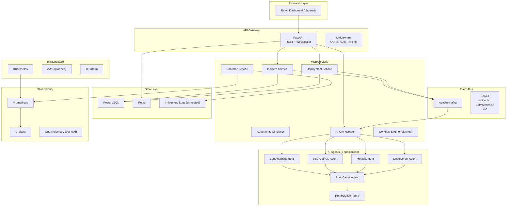
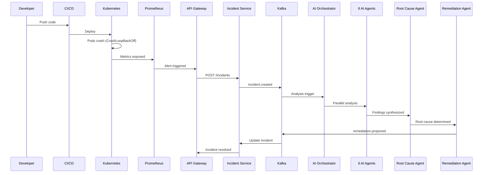
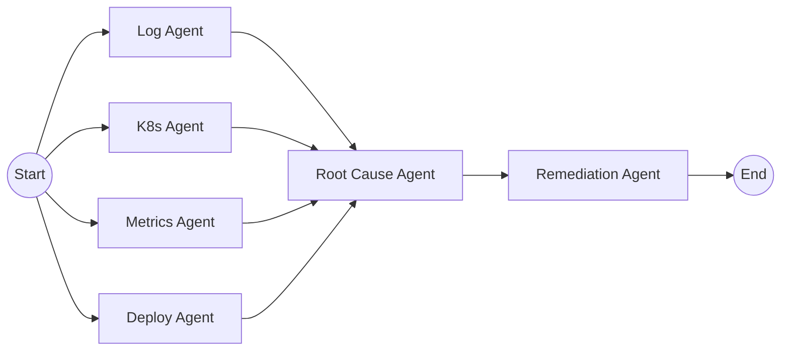

# Sentinel AI — Architecture

## System Overview

Sentinel AI is an autonomous cloud operations platform that monitors infrastructure, investigates incidents, explains failures, and proposes fixes using a multi-agent AI system.

## High-Level Architecture

> **MVP note:** Components marked with `(planned)` are in the architecture but not yet implemented.

## Data Flow — Incident Lifecycle

## Multi-Agent Graph (LangGraph)

## Event-Driven Architecture

All inter-service communication flows through Kafka topics:

| Topic | Producer | Consumer | Purpose |
|-------|----------|----------|---------|
| `incidents.created` | Incident Service | AI Orchestrator, Notification Service | New incident detected |
| `incidents.updated` | Incident Service | Notification Service | Status change |
| `incidents.resolved` | Incident Service | Deployment Service | Incident resolved |
| `deployments.created` | Deployment Service | K8s Service | New deployment tracked |
| `deployments.failed` | Deployment Service | Incident Service | **Auto-creates incident** |
| `ai.analysis.started` | AI Orchestrator | Notification Service | Analysis begins |
| `ai.analysis.completed` | AI Orchestrator | Incident Service | Results ready |
| `ai.remediation.proposed` | AI Orchestrator | Incident Service, Deployment Service | Fix proposed |
| `notifications` | Notification Service | Slack, Jira, Email | External notifications |

## Design Patterns

### Implemented
- **Idempotent Consumers** — Every Kafka event carries an `event_id`. Consumers track processed IDs to avoid duplicate processing.
- **Dead-Letter Queue** — Failed messages are routed to `{topic}.dlq` for inspection, preventing poison messages from blocking the queue.
- **Event Sourcing (partial)** — Incident timeline events are captured as `IncidentEvent` records, enabling full audit trails.

### Planned
- **Outbox Pattern** — Database writes publish events atomically using the transactional outbox pattern.
- **Circuit Breaker** — External service calls (GitHub, Jira, Slack) use circuit breakers with exponential backoff.

## Key Design Decisions

- **Simulation mode**: Every external integration has a simulation fallback, making the system demo-able without any API keys
- **Dual-mode LLM**: Uses real OpenAI/Anthropic when keys are provided, falls back to deterministic simulation otherwise
- **Event sourcing for incident timeline**: All state changes are captured as events, enabling full audit trails
- **Parallel agent execution**: Four analysis agents run concurrently before root cause synthesis
- **MCP tool catalog**: All external systems (K8s, GitHub, Jira, Prometheus, Slack) exposed as MCP tools
