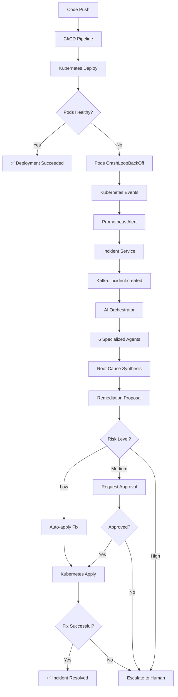
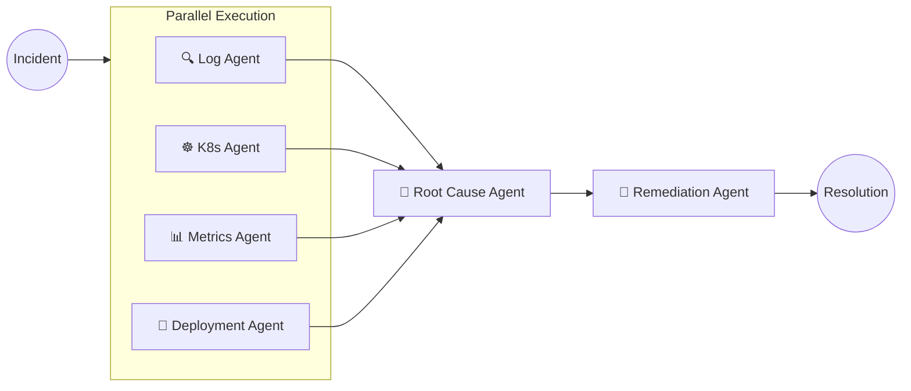
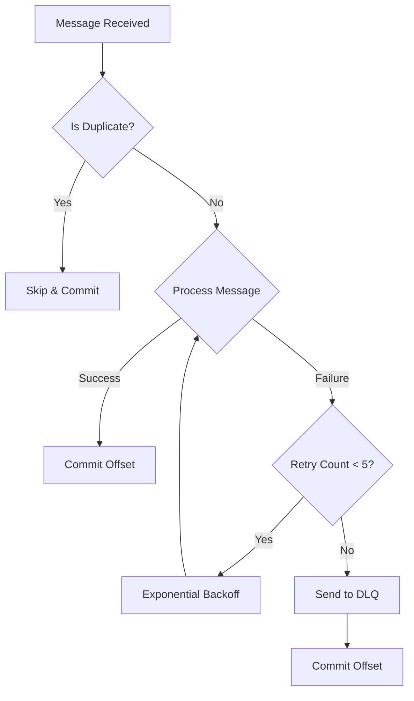

# Event Flow Diagrams

## Deployment Failure → Incident → Resolution

```mermaid
flowchart TD
    A[Code Push] --> B[CI/CD Pipeline]
    B --> C[Kubernetes Deploy]
    C --> D{Pods Healthy?}
    D -->|Yes| E[✅ Deployment Succeeded]
    D -->|No| F[Pods CrashLoopBackOff]
    F --> G[Kubernetes Events]
    G --> H[Prometheus Alert]
    H --> I[Incident Service]
    I --> J[Kafka: incident.created]
    J --> K[AI Orchestrator]
    K --> L[6 Specialized Agents]
    L --> M[Root Cause Synthesis]
    M --> N[Remediation Proposal]
    N --> O{Risk Level?}
    O -->|Low| P[Auto-apply Fix]
    O -->|Medium| Q[Request Approval]
    O -->|High| R[Escalate to Human]
    P --> S[Kubernetes Apply]
    S --> T{Fix Successful?}
    T -->|Yes| U[✅ Incident Resolved]
    T -->|No| R
    Q --> V{Approved?}
    V -->|Yes| S
    V -->|No| R
```

## Agent Execution Flow

```mermaid
flowchart LR
    subgraph Parallel["Parallel Execution"]
        direction TB
        LA[🔍 Log Agent]
        KA[☸️ K8s Agent]
        MA[📊 Metrics Agent]
        DA[🚀 Deployment Agent]
    end

    Start((Incident)) --> Parallel
    LA --> Synth[🧠 Root Cause Agent]
    KA --> Synth
    MA --> Synth
    DA --> Synth
    Synth --> Remed[💊 Remediation Agent]
    Remed --> Output((Resolution))
```

## Message Processing Pipeline

```mermaid
flowchart TD
    A[Message Received] --> B{Is Duplicate?}
    B -->|Yes| C[Skip & Commit]
    B -->|No| D{Process Message}
    D -->|Success| E[Commit Offset]
    D -->|Failure| F{Retry Count < 5?}
    F -->|Yes| G[Exponential Backoff]
    G --> D
    F -->|No| H[Send to DLQ]
    H --> I[Commit Offset]
```
